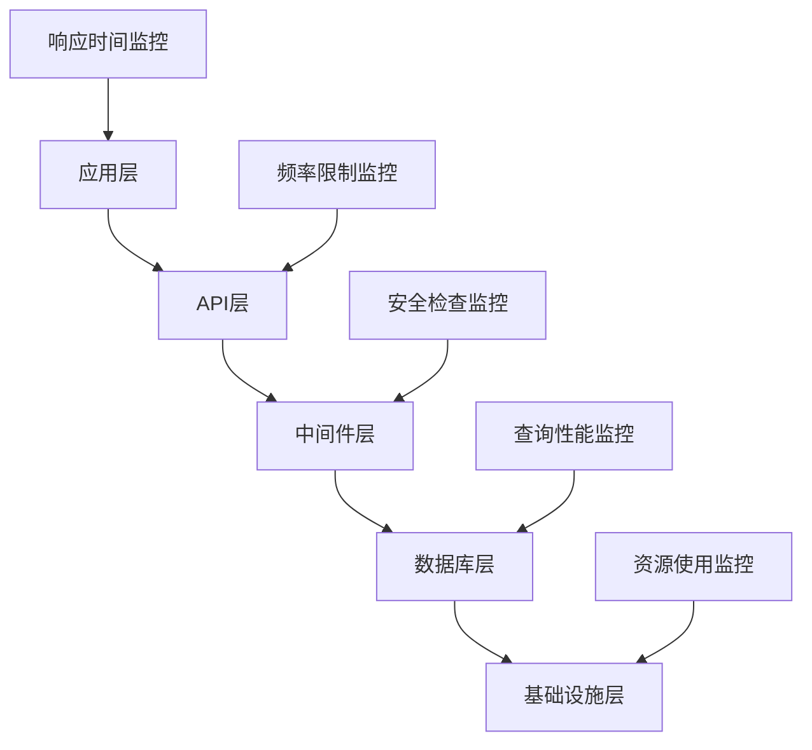

# 性能优化指南

## 📊 概述

本文档详细介绍了Health Butler系统的性能优化策略、监控方法和最佳实践。遵循这些指南可以确保系统的高性能、高可用性和良好的用户体验。

## 🚀 性能架构

### 性能监控层级


### 核心性能指标
- **响应时间**: P50 < 100ms, P95 < 500ms, P99 < 1000ms
- **数据库查询**: 平均 < 100ms, 慢查询 < 500ms
- **内存使用**: < 80%, 告警阈值 90%
- **CPU使用**: < 70%, 告警阈值 85%
- **错误率**: < 1%, 告警阈值 5%

## 📈 API性能优化

### 查询优化
```typescript
// 使用优化的查询中间件
import { optimizedQuery } from '@/lib/middleware/query-optimization'

export const GET = async (request: NextRequest) => {
  // 智能分页查询
  const [data, total] = await Promise.all([
    optimizedQuery.findMany('model', {
      where,
      take: Math.min(limit, 100),  // 最大限制
      skip,
      include: {
        relation: {
          select: { id: true, name: true }  // 只选择必要字段
        }
      },
      useCache: true,
      cacheKey: `query_${JSON.stringify({ where, skip, take })}`
    }),
    optimizedQuery.count('model', where, { useCache: true })
  ])
  
  return NextResponse.json({
    data,
    pagination: {
      page,
      limit,
      total,
      totalPages: Math.ceil(total / limit)
    }
  })
}
```

### 缓存策略
```typescript
// 多层缓存架构
const cacheStrategy = {
  // L1: 内存缓存 (5分钟)
  memory: { ttl: 300000, maxSize: 1000 },
  
  // L2: Redis缓存 (30分钟)
  redis: { ttl: 1800000, cluster: true },
  
  // L3: CDN缓存 (1小时)
  cdn: { ttl: 3600000, edge: true }
}

// 智能缓存键生成
const generateCacheKey = (model: string, params: any) => {
  const hash = createHash('md5').update(JSON.stringify(params)).digest('hex')
  return `${model}:${hash}`
}
```

### 并发控制
```typescript
// 请求并发限制
class ConcurrencyLimiter {
  private static limiters = new Map<string, Semaphore>()
  
  static async execute<T>(
    key: string,
    fn: () => Promise<T>,
    maxConcurrent: number = 10
  ): Promise<T> {
    if (!this.limiters.has(key)) {
      this.limiters.set(key, new Semaphore(maxConcurrent))
    }
    
    const semaphore = this.limiters.get(key)!
    return await semaphore.acquire(fn)
  }
}

// 在API中使用
export const POST = async (request: NextRequest) => {
  return await ConcurrencyLimiter.execute(
    'heavy_operation',
    () => performHeavyOperation(request),
    5  // 最大5个并发
  )
}
```

## 🗃️ 数据库性能优化

### 索引优化
```sql
-- 复合索引优化
CREATE INDEX idx_family_members_active 
ON family_members (family_id, deleted_at, role);

-- 部分索引优化
CREATE INDEX idx_health_data_recent 
ON health_data (measured_at, member_id) 
WHERE measured_at > NOW() - INTERVAL '30 days';

-- 覆盖索引优化
CREATE INDEX idx_tasks_covering 
ON tasks (status, priority, due_date) 
INCLUDE (id, title, assigned_to_id);
```

### 查询优化
```typescript
// 分页查询优化
const optimizedPagination = {
  // 避免OFFSET的游标分页
  cursor: {
    id: string,        // 最后一条记录的ID
    createdAt: Date    // 最后一条记录的时间
  },
  
  // 预聚合查询
  aggregations: {
    totalCount: 'SELECT COUNT(*) FROM table WHERE condition',
    recentItems: 'SELECT * FROM table WHERE created_at > NOW() - INTERVAL \'7 days\''
  }
}

// 批量操作优化
const batchOperations = {
  // 批量插入
  insert: async (data: any[]) => {
    const chunks = chunk(data, 100)  // 每批100条
    return await Promise.all(
      chunks.map(chunk => prisma.model.createMany({ data: chunk }))
    )
  },
  
  // 批量更新
  update: async (updates: { id: string; data: any }[]) => {
    return await prisma.$transaction(
      updates.map(({ id, data }) => 
        prisma.model.update({ where: { id }, data })
      )
    )
  }
}
```

### 连接池优化
```typescript
// Prisma连接池配置
const prisma = new PrismaClient({
  datasources: {
    db: {
      url: process.env.DATABASE_URL
    }
  },
  log: process.env.NODE_ENV === 'development' ? ['query', 'info', 'warn', 'error'] : ['error'],
  // 连接池设置
  __internal: {
    engine: {
      connectionLimit: 20,
      connectionTimeout: 10000,
      idleTimeout: 30000
    }
  }
})
```

## 💾 内存管理优化

### 内存监控
```typescript
// 内存使用监控
class MemoryMonitor {
  private static interval: NodeJS.Timeout | null = null
  
  static start() {
    this.interval = setInterval(() => {
      const usage = process.memoryUsage()
      const heapUsedMB = usage.heapUsed / 1024 / 1024
      const heapTotalMB = usage.heapTotal / 1024 / 1024
      const percentage = (heapUsedMB / heapTotalMB) * 100
      
      if (percentage > 80) {
        logger.warn('内存使用过高', {
          heapUsed: heapUsedMB,
          heapTotal: heapTotalMB,
          percentage
        })
        
        // 触发垃圾回收
        if (global.gc) {
          global.gc()
        }
      }
    }, 30000)  // 每30秒检查一次
  }
  
  static stop() {
    if (this.interval) {
      clearInterval(this.interval)
      this.interval = null
    }
  }
}
```

### 对象池优化
```typescript
// 对象池实现
class ObjectPool<T> {
  private pool: T[] = []
  private factory: () => T
  private resetFn: (obj: T) => void
  
  constructor(factory: () => T, resetFn: (obj: T) => void, initialSize: number = 10) {
    this.factory = factory
    this.resetFn = resetFn
    
    // 预创建对象
    for (let i = 0; i < initialSize; i++) {
      this.pool.push(factory())
    }
  }
  
  acquire(): T {
    return this.pool.pop() || this.factory()
  }
  
  release(obj: T) {
    this.resetFn(obj)
    this.pool.push(obj)
  }
}

// 使用示例
const bufferPool = new ObjectPool(
  () => Buffer.alloc(1024),
  (buf) => buf.fill(0),
  50
)

// 获取缓冲区
const buffer = bufferPool.acquire()
// 使用缓冲区
// ...
// 释放缓冲区
bufferPool.release(buffer)
```

## 🔧 中间件性能优化

### 性能监控中间件
```typescript
// 轻量级性能监控
const performanceMiddleware = (handler: Function) => {
  return async (request: NextRequest) => {
    const startTime = performance.now()
    const memoryBefore = process.memoryUsage()
    
    try {
      const response = await handler(request)
      const endTime = performance.now()
      const memoryAfter = process.memoryUsage()
      
      // 记录性能指标
      const metrics = {
        responseTime: endTime - startTime,
        memoryDelta: memoryAfter.heapUsed - memoryBefore.heapUsed,
        statusCode: response.status
      }
      
      // 异步记录，避免影响响应时间
      setImmediate(() => recordMetrics(metrics))
      
      return response
    } catch (error) {
      const endTime = performance.now()
      recordErrorMetrics({
        responseTime: endTime - startTime,
        error: error.message
      })
      throw error
    }
  }
}
```

### 安全检查优化
```typescript
// 并行安全检查
const optimizedSecurityCheck = async (request: NextRequest) => {
  const [sqlResult, xssResult, rateResult] = await Promise.all([
    SQLInjectionDetector.check(request),
    XSSDetector.check(request),
    RateLimiter.check(request)
  ])
  
  return {
    safe: !sqlResult.detected && !xssResult.detected && rateResult.allowed,
    threats: [
      ...(sqlResult.detected ? [`SQL注入: ${sqlResult.pattern}`] : []),
      ...(xssResult.detected ? [`XSS攻击: ${xssResult.pattern}`] : []),
      ...(!rateResult.allowed ? ['频率限制'] : [])
    ]
  }
}
```

## 📱 前端性能优化

### 资源优化
```typescript
// 静态资源优化
const staticOptimization = {
  // 图片优化
  images: {
    formats: ['webp', 'avif'],
    sizes: [320, 640, 960, 1280],
    quality: 80,
    lazy: true
  },
  
  // 字体优化
  fonts: {
    preload: true,
    display: 'swap',
    subsets: ['latin', 'latin-ext']
  },
  
  // JavaScript优化
  scripts: {
    minify: true,
    treeshake: true,
    codeSplit: true,
    prefetch: true
  }
}

// 缓存策略
const cacheStrategy = {
  static: {
    '/*.js': 'max-age=31536000, immutable',
    '/*.css': 'max-age=31536000, immutable',
    '/*.woff2': 'max-age=31536000, immutable'
  },
  api: {
    '*/api/*': 'no-cache, must-revalidate',
    '*/api/public/*': 'max-age=300'
  }
}
```

### 数据预加载
```typescript
// 智能数据预加载
const dataPrefetch = {
  // 预测性预加载
  predict: (userBehavior: UserBehavior) => {
    const predictions = mlModel.predict(userBehavior)
    return predictions.map(item => ({
      url: `/api/${item.endpoint}`,
      priority: item.probability
    }))
  },
  
  // 基于路由的预加载
  routeBased: (currentRoute: string) => {
    const prefetchMap = {
      '/dashboard': ['/api/user/stats', '/api/family/recent'],
      '/health': ['/api/health/data', '/api/goals/active'],
      '/shopping': ['/api/shopping/list', '/api/inventory/items']
    }
    
    return prefetchMap[currentRoute] || []
  }
}
```

## 🔄 负载均衡和扩展

### 应用层负载均衡
```typescript
// 智能负载分配
const loadBalancer = {
  // 算法选择
  algorithm: {
    roundRobin: (servers: Server[]) => {
      let index = 0
      return () => servers[index++ % servers.length]
    },
    
    leastConnections: (servers: Server[]) => {
      return () => servers.reduce((min, server) => 
        server.connections < min.connections ? server : min
      )
    },
    
    weighted: (servers: WeightedServer[]) => {
      const totalWeight = servers.reduce((sum, s) => sum + s.weight, 0)
      return () => {
        const random = Math.random() * totalWeight
        let currentWeight = 0
        
        for (const server of servers) {
          currentWeight += server.weight
          if (random <= currentWeight) {
            return server
          }
        }
        
        return servers[0]
      }
    }
  },
  
  // 健康检查
  healthCheck: {
    interval: 30000,
    timeout: 5000,
    retries: 3,
    endpoint: '/health'
  }
}
```

### 自动扩展
```typescript
// 动态扩展策略
const autoScaling = {
  // 扩展触发条件
  triggers: {
    cpu: { scaleUp: 70, scaleDown: 30 },
    memory: { scaleUp: 80, scaleDown: 40 },
    responseTime: { scaleUp: 1000, scaleDown: 200 },
    queueLength: { scaleUp: 100, scaleDown: 10 }
  },
  
  // 扩展策略
  policies: {
    scaleUp: {
      minInstances: 2,
      maxInstances: 20,
      cooldown: 300000,  // 5分钟
      scaleBy: 2        // 每次增加2个实例
    },
    
    scaleDown: {
      minInstances: 2,
      maxInstances: 20,
      cooldown: 600000,  // 10分钟
      scaleBy: 1        // 每次减少1个实例
    }
  }
}
```

## 📊 性能监控和告警

### 实时监控
```typescript
// 性能监控仪表板
class PerformanceDashboard {
  private metrics = {
    // API性能
    api: {
      responseTime: new TimeSeries(),
      throughput: new TimeSeries(),
      errorRate: new TimeSeries()
    },
    
    // 数据库性能
    database: {
      queryTime: new TimeSeries(),
      connections: new TimeSeries(),
      slowQueries: new TimeSeries()
    },
    
    // 系统资源
    system: {
      cpu: new TimeSeries(),
      memory: new TimeSeries(),
      disk: new TimeSeries()
    }
  }
  
  // 告警配置
  alerts = {
    responseTime: { threshold: 1000, severity: 'high' },
    errorRate: { threshold: 5, severity: 'critical' },
    memory: { threshold: 85, severity: 'medium' },
    cpu: { threshold: 80, severity: 'medium' }
  }
  
  // 实时数据更新
  async updateMetrics() {
    const apiMetrics = await this.getAPIMetrics()
    const dbMetrics = await this.getDBMetrics()
    const systemMetrics = await this.getSystemMetrics()
    
    this.metrics.api.responseTime.add(apiMetrics.responseTime)
    this.metrics.api.throughput.add(apiMetrics.throughput)
    this.metrics.api.errorRate.add(apiMetrics.errorRate)
    
    this.metrics.database.queryTime.add(dbMetrics.queryTime)
    this.metrics.database.connections.add(dbMetrics.connections)
    
    this.metrics.system.cpu.add(systemMetrics.cpu)
    this.metrics.system.memory.add(systemMetrics.memory)
    
    // 检查告警
    this.checkAlerts()
  }
}
```

### 性能分析报告
```typescript
// 性能报告生成
class PerformanceReport {
  // 日报
  generateDailyReport(date: Date): DailyReport {
    return {
      date,
      summary: {
        totalRequests: this.getTotalRequests(date),
        averageResponseTime: this.getAverageResponseTime(date),
        errorRate: this.getErrorRate(date),
        peakTraffic: this.getPeakTraffic(date)
      },
      topSlowQueries: this.getTopSlowQueries(date),
      errorAnalysis: this.getErrorAnalysis(date),
      resourceUtilization: this.getResourceUtilization(date)
    }
  }
  
  // 周报
  generateWeeklyReport(startDate: Date): WeeklyReport {
    return {
      weekStart: startDate,
      weekEnd: new Date(startDate.getTime() + 7 * 24 * 60 * 60 * 1000),
      trends: {
        responseTimeTrend: this.getResponseTimeTrend(startDate),
        errorRateTrend: this.getErrorRateTrend(startDate),
        trafficTrend: this.getTrafficTrend(startDate)
      },
      performanceScore: this.calculatePerformanceScore(startDate),
      recommendations: this.generateRecommendations(startDate)
    }
  }
}
```

## 🛠️ 性能调试工具

### 性能分析器
```typescript
// 内置性能分析器
class Profiler {
  private static enabled = process.env.NODE_ENV === 'development'
  
  static async profile<T>(name: string, fn: () => Promise<T>): Promise<T> {
    if (!this.enabled) {
      return await fn()
    }
    
    const start = process.hrtime.bigint()
    const memoryBefore = process.memoryUsage()
    
    try {
      const result = await fn()
      const end = process.hrtime.bigint()
      const memoryAfter = process.memoryUsage()
      
      const duration = Number(end - start) / 1000000 // 转换为毫秒
      const memoryDelta = memoryAfter.heapUsed - memoryBefore.heapUsed
      
      console.log(`[PROFILE] ${name}: ${duration.toFixed(2)}ms, Memory: ${memoryDelta}B`)
      
      return result
    } catch (error) {
      console.log(`[PROFILE] ${name}: ERROR - ${error.message}`)
      throw error
    }
  }
}

// 使用示例
export const GET = async (request: NextRequest) => {
  return await Profiler.profile('api_handler', async () => {
    // 业务逻辑
    return await handleRequest(request)
  })
}
```

### 内存泄漏检测
```typescript
// 内存泄漏检测
class MemoryLeakDetector {
  private snapshots: NodeJS.MemoryUsage[] = []
  private maxSnapshots = 100
  
  takeSnapshot() {
    const usage = process.memoryUsage()
    this.snapshots.push(usage)
    
    if (this.snapshots.length > this.maxSnapshots) {
      this.snapshots.shift()
    }
    
    this.detectLeak()
  }
  
  private detectLeak() {
    if (this.snapshots.length < 10) return
    
    const recent = this.snapshots.slice(-10)
    const memoryGrowth = recent[recent.length - 1].heapUsed - recent[0].heapUsed
    
    if (memoryGrowth > 50 * 1024 * 1024) { // 50MB增长
      logger.warn('检测到潜在的内存泄漏', {
        memoryGrowth: memoryGrowth / 1024 / 1024,
        snapshots: recent.map(s => s.heapUsed / 1024 / 1024)
      })
    }
  }
}
```

## 📋 性能检查清单

### 代码层面
- [ ] 避免N+1查询问题
- [ ] 使用适当的数据类型和索引
- [ ] 实现查询缓存机制
- [ ] 优化对象创建和销毁
- [ ] 使用对象池减少GC压力

### 架构层面
- [ ] 实现分层缓存策略
- [ ] 配置适当的负载均衡
- [ ] 设置自动扩展策略
- [ ] 实现熔断和降级机制
- [ ] 优化数据库连接池

### 监控层面
- [ ] 设置关键性能指标监控
- [ ] 配置多级告警机制
- [ ] 实现性能分析工具
- [ ] 建立性能基线和目标
- [ ] 定期生成性能报告

### 运维层面
- [ ] 定期执行性能基准测试
- [ ] 监控系统资源使用情况
- [ ] 及时更新依赖和补丁
- [ ] 优化基础设施配置
- [ ] 建立故障恢复流程

## 🎯 性能目标

### 短期目标 (1个月)
- API响应时间: P95 < 500ms
- 数据库查询时间: 平均 < 100ms
- 系统可用性: > 99.5%
- 错误率: < 1%

### 中期目标 (3个月)
- API响应时间: P95 < 300ms
- 数据库查询时间: 平均 < 50ms
- 系统可用性: > 99.9%
- 错误率: < 0.5%

### 长期目标 (6个月)
- API响应时间: P95 < 200ms
- 数据库查询时间: 平均 < 30ms
- 系统可用性: > 99.95%
- 错误率: < 0.1%

## 📚 相关资源

- [Next.js性能优化](https://nextjs.org/docs/advanced-features/measuring-performance)
- [Prisma性能指南](https://www.prisma.io/docs/guides/performance-optimization)
- [Node.js性能最佳实践](https://nodejs.org/en/docs/guides/simple-profiling)
- [Web性能优化](https://web.dev/performance/)

---

**版本**: 1.0.0  
**更新日期**: 2024-01-01  
**维护团队**: Health Butler Performance Team
