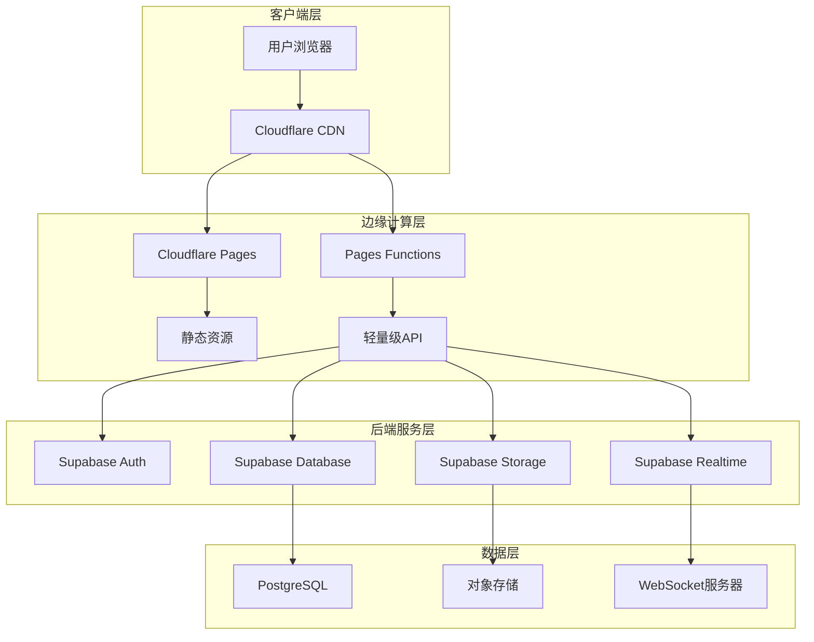

# Cloudflare Pages + Supabase 混合架构设计

## 架构概览

本设计采用分层架构模式，将Health Butler应用重构为边缘优化的混合云架构，充分利用Cloudflare的全球CDN网络和Supabase的现代后端服务。



## 详细架构组件

### 1. 前端架构（Cloudflare Pages）

#### 1.1 Next.js静态导出配置
```typescript
// next.config.js
const nextConfig = {
  output: 'export', // 关键配置：启用静态导出
  images: {
    unoptimized: true, // 静态导出必需
    domains: ['supabase.co'], // 允许Supabase图片域名
  },
  trailingSlash: true, // 确保URL一致性
  distDir: '.next', // 构建输出目录

  // 环境变量配置
  env: {
    NEXT_PUBLIC_SUPABASE_URL: process.env.NEXT_PUBLIC_SUPABASE_URL,
    NEXT_PUBLIC_SUPABASE_ANON_KEY: process.env.NEXT_PUBLIC_SUPABASE_ANON_KEY,
    NEXT_PUBLIC_SITE_URL: process.env.NEXT_PUBLIC_SITE_URL,
  },

  // 优化配置
  swcMinify: true,
  compress: true,
  generateEtags: true,

  // 实验性功能
  experimental: {
    optimizeCss: true,
    scrollRestoration: true,
  },
};
```

#### 1.2 客户端架构设计
```typescript
// src/lib/supabase-client.ts
import { createClient } from '@supabase/supabase-js';
import type { Database } from '@/types/supabase';

class SupabaseClient {
  private static instance: SupabaseClient;
  private client: any;

  private constructor() {
    this.client = createClient<Database>(
      process.env.NEXT_PUBLIC_SUPABASE_URL!,
      process.env.NEXT_PUBLIC_SUPABASE_ANON_KEY!,
      {
        auth: {
          persistSession: true,
          autoRefreshToken: true,
          detectSessionInUrl: true,
        },
        global: {
          headers: {
            'x-application-name': 'health-butler',
          },
        },
        db: {
          schema: 'public',
        },
        realtime: {
          params: {
            eventsPerSecond: 10,
          },
        },
      }
    );
  }

  public static getInstance(): SupabaseClient {
    if (!SupabaseClient.instance) {
      SupabaseClient.instance = new SupabaseClient();
    }
    return SupabaseClient.instance;
  }

  public getClient() {
    return this.client;
  }
}

export const supabase = SupabaseClient.getInstance().getClient();
```

#### 1.3 数据获取策略
```typescript
// src/lib/data-fetching.ts
export class DataFetcher {
  // 静态数据：构建时获取
  static async getStaticData(path: string) {
    const response = await fetch(`/api/static${path}`);
    return response.json();
  }

  // 动态数据：客户端获取
  static async getDynamicData(path: string, options?: RequestInit) {
    const response = await fetch(`/api/dynamic${path}`, {
      ...options,
      headers: {
        'Content-Type': 'application/json',
        ...options?.headers,
      },
    });

    if (!response.ok) {
      throw new Error(`API call failed: ${response.status}`);
    }

    return response.json();
  }

  // 实时数据：Supabase订阅
  static subscribeToData(channel: string, callback: (data: any) => void) {
    return supabase
      .channel(channel)
      .on('postgres_changes', { event: '*', schema: 'public' }, callback)
      .subscribe();
  }
}
```

### 2. API层（Pages Functions）

#### 2.1 函数架构设计
```
functions/
├── api/
│   ├── v1/
│   │   ├── health/
│   │   │   ├── index.js          # 健康数据API
│   │   │   ├── trends.js         # 健康趋势分析
│   │   │   └── recommendations.js # 健康建议
│   │   ├── nutrition/
│   │   │   ├── search.js         # 食物搜索
│   │   │   ├── analysis.js       # 营养分析
│   │   │   └── tracking.js       # 营养跟踪
│   │   ├── recipes/
│   │   │   ├── search.js         # 食谱搜索
│   │   │   ├── recommend.js      # 食谱推荐
│   │   │   └── favorite.js       # 收藏管理
│   │   ├── users/
│   │   │   ├── profile.js        # 用户资料
│   │   │   ├── preferences.js    # 用户偏好
│   │   │   └── settings.js       # 用户设置
│   │   └── family/
│   │       ├── members.js        # 家庭成员
│   │       ├── sharing.js        # 数据共享
│   │       └── permissions.js    # 权限管理
│   ├── auth/
│   │   ├── login.js              # 用户登录
│   │   ├── logout.js             # 用户登出
│   │   ├── refresh.js            # 令牌刷新
│   │   └── callback.js           # 认证回调
│   └── utils/
│       ├── supabase.js           # Supabase客户端
│       ├── validation.js         # 输入验证
│       ├── response.js           # 响应处理
│       └── error-handler.js      # 错误处理
├── middleware/
│   ├── auth.js                   # 认证中间件
│   ├── cors.js                   # CORS处理
│   ├── rate-limit.js             # 限流控制
│   └── logging.js                # 日志记录
└── config/
    ├── constants.js              # 常量配置
    └── environment.js            # 环境变量
```

#### 2.2 核心API函数实现
```javascript
// functions/api/v1/health/index.js
import { createSupabaseClient } from '../../utils/supabase.js';
import { validateAuth } from '../../middleware/auth.js';
import { handleError } from '../../utils/error-handler.js';
import { createSuccessResponse } from '../../utils/response.js';

export async function onRequestGet(context) {
  const { request, env } = context;

  try {
    // 1. 认证验证
    const user = await validateAuth(request, env);

    // 2. 创建Supabase客户端
    const supabase = createSupabaseClient(env);

    // 3. 查询参数处理
    const url = new URL(request.url);
    const limit = parseInt(url.searchParams.get('limit') || '20');
    const offset = parseInt(url.searchParams.get('offset') || '0');
    const type = url.searchParams.get('type');

    // 4. 数据库查询
    let query = supabase
      .from('health_data')
      .select(`
        *,
        user:users!user_id(id, name, email)
      `)
      .eq('user_id', user.id)
      .order('recorded_at', { ascending: false })
      .range(offset, offset + limit - 1);

    if (type) {
      query = query.eq('data_type', type);
    }

    const { data, error } = await query;

    if (error) {
      throw new Error(`Database query failed: ${error.message}`);
    }

    // 5. 返回响应
    return createSuccessResponse({
      data: data,
      pagination: {
        limit,
        offset,
        total: data.length
      },
      timestamp: new Date().toISOString()
    });

  } catch (error) {
    return handleError(error);
  }
}

export async function onRequestPost(context) {
  const { request, env } = context;

  try {
    // 1. 认证验证
    const user = await validateAuth(request, env);

    // 2. 请求体解析
    const body = await request.json();

    // 3. 数据验证
    const { data_type, value, unit, recorded_at } = body;

    if (!data_type || !value) {
      throw new Error('Missing required fields: data_type, value');
    }

    // 4. 创建Supabase客户端
    const supabase = createSupabaseClient(env);

    // 5. 数据插入
    const { data, error } = await supabase
      .from('health_data')
      .insert({
        user_id: user.id,
        data_type,
        value,
        unit,
        recorded_at: recorded_at || new Date().toISOString()
      })
      .select()
      .single();

    if (error) {
      throw new Error(`Database insert failed: ${error.message}`);
    }

    // 6. 返回响应
    return createSuccessResponse({
      data: data,
      message: 'Health data created successfully',
      timestamp: new Date().toISOString()
    }, 201);

  } catch (error) {
    return handleError(error);
  }
}
```

#### 2.3 认证中间件
```javascript
// functions/middleware/auth.js
import { createSupabaseClient } from '../utils/supabase.js';

export async function validateAuth(request, env) {
  // 1. 获取认证令牌
  const authHeader = request.headers.get('Authorization');
  if (!authHeader || !authHeader.startsWith('Bearer ')) {
    throw new Error('Missing or invalid authorization header');
  }

  const token = authHeader.replace('Bearer ', '');

  // 2. 创建Supabase客户端
  const supabase = createSupabaseClient(env);

  // 3. 验证令牌
  const { data: { user }, error } = await supabase.auth.getUser(token);

  if (error || !user) {
    throw new Error('Invalid or expired token');
  }

  // 4. 返回用户信息
  return {
    id: user.id,
    email: user.email,
    user_metadata: user.user_metadata || {}
  };
}

export async function optionalAuth(request, env) {
  try {
    return await validateAuth(request, env);
  } catch (error) {
    return null;
  }
}
```

### 3. 数据库架构（Supabase）

#### 3.1 数据库设计
```sql
-- 用户表（使用Supabase Auth）
CREATE TABLE IF NOT EXISTS users (
  id UUID PRIMARY KEY DEFAULT auth.uid(),
  email TEXT UNIQUE NOT NULL,
  name TEXT,
  avatar_url TEXT,
  created_at TIMESTAMP WITH TIME ZONE DEFAULT NOW(),
  updated_at TIMESTAMP WITH TIME ZONE DEFAULT NOW()
);

-- 健康数据表
CREATE TABLE IF NOT EXISTS health_data (
  id UUID PRIMARY KEY DEFAULT gen_random_uuid(),
  user_id UUID REFERENCES users(id) ON DELETE CASCADE,
  data_type TEXT NOT NULL, -- 'weight', 'blood_pressure', 'blood_sugar', etc.
  value NUMERIC NOT NULL,
  unit TEXT, -- 'kg', 'mmHg', 'mg/dL', etc.
  metadata JSONB DEFAULT '{}',
  recorded_at TIMESTAMP WITH TIME ZONE DEFAULT NOW(),
  created_at TIMESTAMP WITH TIME ZONE DEFAULT NOW(),
  updated_at TIMESTAMP WITH TIME ZONE DEFAULT NOW()
);

-- 饮食记录表
CREATE TABLE IF NOT EXISTS meal_records (
  id UUID PRIMARY KEY DEFAULT gen_random_uuid(),
  user_id UUID REFERENCES users(id) ON DELETE CASCADE,
  meal_type TEXT NOT NULL, -- 'breakfast', 'lunch', 'dinner', 'snack'
  foods JSONB NOT NULL, -- 食物详情数组
  total_calories INTEGER,
  total_protein NUMERIC,
  total_carbs NUMERIC,
  total_fat NUMERIC,
  recorded_at TIMESTAMP WITH TIME ZONE DEFAULT NOW(),
  created_at TIMESTAMP WITH TIME ZONE DEFAULT NOW(),
  updated_at TIMESTAMP WITH TIME ZONE DEFAULT NOW()
);

-- 食谱表
CREATE TABLE IF NOT EXISTS recipes (
  id UUID PRIMARY KEY DEFAULT gen_random_uuid(),
  name TEXT NOT NULL,
  description TEXT,
  ingredients JSONB NOT NULL,
  instructions JSONB NOT NULL,
  nutrition_info JSONB,
  prep_time INTEGER, -- 分钟
  cook_time INTEGER, -- 分钟
  servings INTEGER,
  difficulty TEXT, -- 'easy', 'medium', 'hard'
  tags TEXT[],
  image_url TEXT,
  created_by UUID REFERENCES users(id),
  is_public BOOLEAN DEFAULT false,
  created_at TIMESTAMP WITH TIME ZONE DEFAULT NOW(),
  updated_at TIMESTAMP WITH TIME ZONE DEFAULT NOW()
);

-- 用户偏好表
CREATE TABLE IF NOT EXISTS user_preferences (
  id UUID PRIMARY KEY DEFAULT gen_random_uuid(),
  user_id UUID UNIQUE REFERENCES users(id) ON DELETE CASCADE,
  dietary_restrictions TEXT[], -- 'vegetarian', 'vegan', 'gluten_free', etc.
  health_goals TEXT[], -- 'weight_loss', 'muscle_gain', 'maintenance', etc.
  cuisine_preferences TEXT[], -- 'chinese', 'italian', 'japanese', etc.
  allergen_avoidance TEXT[], -- 'nuts', 'dairy', 'shellfish', etc.
  calorie_target INTEGER,
  macro_targets JSONB, -- 宏量营养素目标
  created_at TIMESTAMP WITH TIME ZONE DEFAULT NOW(),
  updated_at TIMESTAMP WITH TIME ZONE DEFAULT NOW()
);

-- 家庭组表
CREATE TABLE IF NOT EXISTS families (
  id UUID PRIMARY KEY DEFAULT gen_random_uuid(),
  name TEXT NOT NULL,
  invite_code TEXT UNIQUE NOT NULL,
  created_by UUID REFERENCES users(id),
  created_at TIMESTAMP WITH TIME ZONE DEFAULT NOW(),
  updated_at TIMESTAMP WITH TIME ZONE DEFAULT NOW()
);

-- 家庭成员表
CREATE TABLE IF NOT EXISTS family_members (
  id UUID PRIMARY KEY DEFAULT gen_random_uuid(),
  family_id UUID REFERENCES families(id) ON DELETE CASCADE,
  user_id UUID REFERENCES users(id) ON DELETE CASCADE,
  role TEXT NOT NULL DEFAULT 'member', -- 'admin', 'member'
  joined_at TIMESTAMP WITH TIME ZONE DEFAULT NOW()
);
```

#### 3.2 行级安全策略（RLS）
```sql
-- 启用RLS
ALTER TABLE users ENABLE ROW LEVEL SECURITY;
ALTER TABLE health_data ENABLE ROW LEVEL SECURITY;
ALTER TABLE meal_records ENABLE ROW LEVEL SECURITY;
ALTER TABLE recipes ENABLE ROW LEVEL SECURITY;
ALTER TABLE user_preferences ENABLE ROW LEVEL SECURITY;
ALTER TABLE family_members ENABLE ROW LEVEL SECURITY;

-- 用户表策略
CREATE POLICY "Users can view own profile" ON users
  FOR SELECT USING (auth.uid() = id);

CREATE POLICY "Users can update own profile" ON users
  FOR UPDATE USING (auth.uid() = id);

-- 健康数据策略
CREATE POLICY "Users can view own health data" ON health_data
  FOR SELECT USING (auth.uid() = user_id);

CREATE POLICY "Users can insert own health data" ON health_data
  FOR INSERT WITH CHECK (auth.uid() = user_id);

CREATE POLICY "Users can update own health data" ON health_data
  FOR UPDATE USING (auth.uid() = user_id);

CREATE POLICY "Users can delete own health data" ON health_data
  FOR DELETE USING (auth.uid() = user_id);

-- 家庭数据共享策略
CREATE POLICY "Family members can view shared health data" ON health_data
  FOR SELECT USING (
    auth.uid() = user_id OR
    EXISTS (
      SELECT 1 FROM family_members fm
      JOIN family_members fm2 ON fm.family_id = fm2.family_id
      WHERE fm.user_id = auth.uid()
      AND fm2.user_id = health_data.user_id
    )
  );

-- 食谱策略
CREATE POLICY "Anyone can view public recipes" ON recipes
  FOR SELECT USING (is_public = true);

CREATE POLICY "Users can view own recipes" ON recipes
  FOR SELECT USING (auth.uid() = created_by);

CREATE POLICY "Users can insert own recipes" ON recipes
  FOR INSERT WITH CHECK (auth.uid() = created_by);

CREATE POLICY "Users can update own recipes" ON recipes
  FOR UPDATE USING (auth.uid() = created_by);
```

#### 3.3 性能优化索引
```sql
-- 健康数据索引
CREATE INDEX idx_health_data_user_id ON health_data(user_id);
CREATE INDEX idx_health_data_type ON health_data(data_type);
CREATE INDEX idx_health_data_recorded_at ON health_data(recorded_at DESC);
CREATE INDEX idx_health_data_composite ON health_data(user_id, data_type, recorded_at DESC);

-- 饮食记录索引
CREATE INDEX idx_meal_records_user_id ON meal_records(user_id);
CREATE INDEX idx_meal_records_meal_type ON meal_records(meal_type);
CREATE INDEX idx_meal_records_recorded_at ON meal_records(recorded_at DESC);
CREATE INDEX idx_meal_records_composite ON meal_records(user_id, recorded_at DESC);

-- 食谱索引
CREATE INDEX idx_recipes_name ON recipes(name);
CREATE INDEX idx_recipes_tags ON recipes USING GIN(tags);
CREATE INDEX idx_recipes_created_by ON recipes(created_by);
CREATE INDEX idx_recipes_is_public ON recipes(is_public);
CREATE INDEX idx_recipes_created_at ON recipes(created_at DESC);

-- 全文搜索索引
CREATE INDEX idx_recipes_name_search ON recipes USING GIN(to_tsvector('english', name));
CREATE INDEX idx_recipes_description_search ON recipes USING GIN(to_tsvector('english', description));
```

### 4. 部署架构

#### 4.1 环境配置
```toml
# wrangler.toml
name = "health-butler-supabase"
main = "functions/index.js"
compatibility_date = "2024-09-23"
pages_build_output_dir = ".next/static"

[env.development]
name = "health-butler-supabase-dev"

[env.development.vars]
NEXT_PUBLIC_SUPABASE_URL = "https://dev-project.supabase.co"
NEXT_PUBLIC_SUPABASE_ANON_KEY = "dev-anon-key"
NODE_ENV = "development"

[env.staging]
name = "health-butler-supabase-staging"

[env.staging.vars]
NEXT_PUBLIC_SUPABASE_URL = "https://staging-project.supabase.co"
NEXT_PUBLIC_SUPABASE_ANON_KEY = "staging-anon-key"
NODE_ENV = "staging"

[env.production]
name = "health-butler-supabase-prod"

[env.production.vars]
NEXT_PUBLIC_SUPABASE_URL = "https://prod-project.supabase.co"
NEXT_PUBLIC_SUPABASE_ANON_KEY = "prod-anon-key"
NODE_ENV = "production"
```

#### 4.2 构建流程
```json
// package.json
{
  "scripts": {
    "dev": "next dev",
    "build": "npm run build:next && npm run build:functions",
    "build:next": "next build && next export",
    "build:functions": "cd functions && npm install && npm run build",
    "deploy": "npm run build && wrangler pages deploy .next/static",
    "deploy:dev": "npm run build && wrangler pages deploy .next/static --env development",
    "deploy:staging": "npm run build && wrangler pages deploy .next/static --env staging",
    "deploy:prod": "npm run build && wrangler pages deploy .next/static --env production"
  }
}
```

## 性能优化策略

### 1. 缓存策略
- **静态资源**：CDN缓存1年
- **API响应**：根据数据变化频率设置不同缓存时间
- **数据库查询**：使用Supabase的查询缓存

### 2. 压缩优化
- **Brotli压缩**：启用Cloudflare的Brotli压缩
- **图片优化**：使用WebP格式，自适应尺寸
- **代码分割**：按需加载JavaScript代码

### 3. 边缘优化
- **就近访问**：利用Cloudflare的全球CDN
- **边缘计算**：在靠近用户的边缘节点处理请求
- **智能路由**：根据用户地理位置路由到最优节点

### 4. 数据库优化
- **连接池**：使用Supabase的连接池管理
- **查询优化**：添加适当的索引和查询优化
- **数据分片**：按用户ID进行数据分区

## 安全设计

### 1. 认证安全
- **JWT令牌**：使用短期有效的JWT令牌
- **刷新机制**：自动刷新过期的访问令牌
- **会话管理**：安全的会话存储和管理

### 2. 数据安全
- **行级安全**：PostgreSQL RLS策略
- **数据加密**：传输和存储加密
- **备份策略**：定期数据备份和恢复测试

### 3. 网络安全
- **HTTPS强制**：所有通信使用HTTPS
- **CORS配置**：严格的跨域请求控制
- **DDoS防护**：Cloudflare的DDoS防护

### 4. 应用安全
- **输入验证**：严格的输入验证和清理
- **SQL注入防护**：使用参数化查询
- **XSS防护**：内容安全策略（CSP）

## 监控和可观测性

### 1. 性能监控
- **Web Analytics**：Cloudflare Web Analytics
- **Core Web Vitals**：监控关键性能指标
- **API性能**：监控API响应时间和错误率

### 2. 错误监控
- **错误日志**：收集和分析应用错误
- **性能瓶颈**：识别性能瓶颈和优化点
- **用户行为**：分析用户使用模式和问题

### 3. 基础设施监控
- **服务健康**：监控所有服务的健康状态
- **资源使用**：监控资源使用情况
- **成本监控**：跟踪服务使用成本

这个架构设计确保了Health Butler应用在迁移到Cloudflare Pages + Supabase混合架构后，能够获得最佳的性能、可扩展性和用户体验。