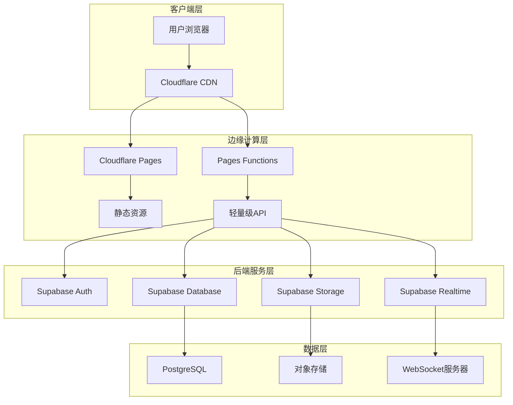

# Cloudflare Pages + Supabase 混合架构设计

## 架构概览

本设计采用分层架构模式，将Health Butler应用重构为边缘优化的混合云架构，充分利用Cloudflare的全球CDN网络和Supabase的现代后端服务。



## 详细架构组件

### 1. 前端架构（Cloudflare Pages）

#### 1.1 Next.js静态导出配置
```typescript
// next.config.js
const nextConfig = {
  output: 'export', // 关键配置：启用静态导出
  images: {
    unoptimized: true, // 静态导出必需
    domains: ['supabase.co'], // 允许Supabase图片域名
  },
  trailingSlash: true, // 确保URL一致性
  distDir: '.next', // 构建输出目录

  // 环境变量配置
  env: {
    NEXT_PUBLIC_SUPABASE_URL: process.env.NEXT_PUBLIC_SUPABASE_URL,
    NEXT_PUBLIC_SUPABASE_ANON_KEY: process.env.NEXT_PUBLIC_SUPABASE_ANON_KEY,
    NEXT_PUBLIC_SITE_URL: process.env.NEXT_PUBLIC_SITE_URL,
  },

  // 优化配置
  swcMinify: true,
  compress: true,
  generateEtags: true,

  // 实验性功能
  experimental: {
    optimizeCss: true,
    scrollRestoration: true,
  },
};
```

#### 1.2 客户端架构设计
```typescript
// src/lib/supabase-client.ts
import { createClient } from '@supabase/supabase-js';
import type { Database } from '@/types/supabase';

class SupabaseClient {
  private static instance: SupabaseClient;
  private client: any;

  private constructor() {
    this.client = createClient<Database>(
      process.env.NEXT_PUBLIC_SUPABASE_URL!,
      process.env.NEXT_PUBLIC_SUPABASE_ANON_KEY!,
      {
        auth: {
          persistSession: true,
          autoRefreshToken: true,
          detectSessionInUrl: true,
        },
        global: {
          headers: {
            'x-application-name': 'health-butler',
          },
        },
        db: {
          schema: 'public',
        },
        realtime: {
          params: {
            eventsPerSecond: 10,
          },
        },
      }
    );
  }

  public static getInstance(): SupabaseClient {
    if (!SupabaseClient.instance) {
      SupabaseClient.instance = new SupabaseClient();
    }
    return SupabaseClient.instance;
  }

  public getClient() {
    return this.client;
  }
}

export const supabase = SupabaseClient.getInstance().getClient();
```

#### 1.3 数据获取策略
```typescript
// src/lib/data-fetching.ts
export class DataFetcher {
  // 静态数据：构建时获取
  static async getStaticData(path: string) {
    const response = await fetch(`/api/static${path}`);
    return response.json();
  }

  // 动态数据：客户端获取
  static async getDynamicData(path: string, options?: RequestInit) {
    const response = await fetch(`/api/dynamic${path}`, {
      ...options,
      headers: {
        'Content-Type': 'application/json',
        ...options?.headers,
      },
    });

    if (!response.ok) {
      throw new Error(`API call failed: ${response.status}`);
    }

    return response.json();
  }

  // 实时数据：Supabase订阅
  static subscribeToData(channel: string, callback: (data: any) => void) {
    return supabase
      .channel(channel)
      .on('postgres_changes', { event: '*', schema: 'public' }, callback)
      .subscribe();
  }
}
```

### 2. API层（Pages Functions）

#### 2.1 函数架构设计
```
functions/
├── api/
│   ├── v1/
│   │   ├── health/
│   │   │   ├── index.js          # 健康数据API
│   │   │   ├── trends.js         # 健康趋势分析
│   │   │   └── recommendations.js # 健康建议
│   │   ├── nutrition/
│   │   │   ├── search.js         # 食物搜索
│   │   │   ├── analysis.js       # 营养分析
│   │   │   └── tracking.js       # 营养跟踪
│   │   ├── recipes/
│   │   │   ├── search.js         # 食谱搜索
│   │   │   ├── recommend.js      # 食谱推荐
│   │   │   └── favorite.js       # 收藏管理
│   │   ├── users/
│   │   │   ├── profile.js        # 用户资料
│   │   │   ├── preferences.js    # 用户偏好
│   │   │   └── settings.js       # 用户设置
│   │   └── family/
│   │       ├── members.js        # 家庭成员
│   │       ├── sharing.js        # 数据共享
│   │       └── permissions.js    # 权限管理
│   ├── auth/
│   │   ├── login.js              # 用户登录
│   │   ├── logout.js             # 用户登出
│   │   ├── refresh.js            # 令牌刷新
│   │   └── callback.js           # 认证回调
│   └── utils/
│       ├── supabase.js           # Supabase客户端
│       ├── validation.js         # 输入验证
│       ├── response.js           # 响应处理
│       └── error-handler.js      # 错误处理
├── middleware/
│   ├── auth.js                   # 认证中间件
│   ├── cors.js                   # CORS处理
│   ├── rate-limit.js             # 限流控制
│   └── logging.js                # 日志记录
└── config/
    ├── constants.js              # 常量配置
    └── environment.js            # 环境变量
```

#### 2.2 核心API函数实现
```javascript
// functions/api/v1/health/index.js
import { createSupabaseClient } from '../../utils/supabase.js';
import { validateAuth } from '../../middleware/auth.js';
import { handleError } from '../../utils/error-handler.js';
import { createSuccessResponse } from '../../utils/response.js';

export async function onRequestGet(context) {
  const { request, env } = context;

  try {
    // 1. 认证验证
    const user = await validateAuth(request, env);

    // 2. 创建Supabase客户端
    const supabase = createSupabaseClient(env);

    // 3. 查询参数处理
    const url = new URL(request.url);
    const limit = parseInt(url.searchParams.get('limit') || '20');
    const offset = parseInt(url.searchParams.get('offset') || '0');
    const type = url.searchParams.get('type');

    // 4. 数据库查询
    let query = supabase
      .from('health_data')
      .select(`
        *,
        user:users!user_id(id, name, email)
      `)
      .eq('user_id', user.id)
      .order('recorded_at', { ascending: false })
      .range(offset, offset + limit - 1);

    if (type) {
      query = query.eq('data_type', type);
    }

    const { data, error } = await query;

    if (error) {
      throw new Error(`Database query failed: ${error.message}`);
    }

    // 5. 返回响应
    return createSuccessResponse({
      data: data,
      pagination: {
        limit,
        offset,
        total: data.length
      },
      timestamp: new Date().toISOString()
    });

  } catch (error) {
    return handleError(error);
  }
}

export async function onRequestPost(context) {
  const { request, env } = context;

  try {
    // 1. 认证验证
    const user = await validateAuth(request, env);

    // 2. 请求体解析
    const body = await request.json();

    // 3. 数据验证
    const { data_type, value, unit, recorded_at } = body;

    if (!data_type || !value) {
      throw new Error('Missing required fields: data_type, value');
    }

    // 4. 创建Supabase客户端
    const supabase = createSupabaseClient(env);

    // 5. 数据插入
    const { data, error } = await supabase
      .from('health_data')
      .insert({
        user_id: user.id,
        data_type,
        value,
        unit,
        recorded_at: recorded_at || new Date().toISOString()
      })
      .select()
      .single();

    if (error) {
      throw new Error(`Database insert failed: ${error.message}`);
    }

    // 6. 返回响应
    return createSuccessResponse({
      data: data,
      message: 'Health data created successfully',
      timestamp: new Date().toISOString()
    }, 201);

  } catch (error) {
    return handleError(error);
  }
}
```

#### 2.3 认证中间件
```javascript
// functions/middleware/auth.js
import { createSupabaseClient } from '../utils/supabase.js';

export async function validateAuth(request, env) {
  // 1. 获取认证令牌
  const authHeader = request.headers.get('Authorization');
  if (!authHeader || !authHeader.startsWith('Bearer ')) {
    throw new Error('Missing or invalid authorization header');
  }

  const token = authHeader.replace('Bearer ', '');

  // 2. 创建Supabase客户端
  const supabase = createSupabaseClient(env);

  // 3. 验证令牌
  const { data: { user }, error } = await supabase.auth.getUser(token);

  if (error || !user) {
    throw new Error('Invalid or expired token');
  }

  // 4. 返回用户信息
  return {
    id: user.id,
    email: user.email,
    user_metadata: user.user_metadata || {}
  };
}

export async function optionalAuth(request, env) {
  try {
    return await validateAuth(request, env);
  } catch (error) {
    return null;
  }
}
```

### 3. 数据库架构（Supabase）

#### 3.1 数据库设计
```sql
-- 用户表（使用Supabase Auth）
CREATE TABLE IF NOT EXISTS users (
  id UUID PRIMARY KEY DEFAULT auth.uid(),
  email TEXT UNIQUE NOT NULL,
  name TEXT,
  avatar_url TEXT,
  created_at TIMESTAMP WITH TIME ZONE DEFAULT NOW(),
  updated_at TIMESTAMP WITH TIME ZONE DEFAULT NOW()
);

-- 健康数据表
CREATE TABLE IF NOT EXISTS health_data (
  id UUID PRIMARY KEY DEFAULT gen_random_uuid(),
  user_id UUID REFERENCES users(id) ON DELETE CASCADE,
  data_type TEXT NOT NULL, -- 'weight', 'blood_pressure', 'blood_sugar', etc.
  value NUMERIC NOT NULL,
  unit TEXT, -- 'kg', 'mmHg', 'mg/dL', etc.
  metadata JSONB DEFAULT '{}',
  recorded_at TIMESTAMP WITH TIME ZONE DEFAULT NOW(),
  created_at TIMESTAMP WITH TIME ZONE DEFAULT NOW(),
  updated_at TIMESTAMP WITH TIME ZONE DEFAULT NOW()
);

-- 饮食记录表
CREATE TABLE IF NOT EXISTS meal_records (
  id UUID PRIMARY KEY DEFAULT gen_random_uuid(),
  user_id UUID REFERENCES users(id) ON DELETE CASCADE,
  meal_type TEXT NOT NULL, -- 'breakfast', 'lunch', 'dinner', 'snack'
  foods JSONB NOT NULL, -- 食物详情数组
  total_calories INTEGER,
  total_protein NUMERIC,
  total_carbs NUMERIC,
  total_fat NUMERIC,
  recorded_at TIMESTAMP WITH TIME ZONE DEFAULT NOW(),
  created_at TIMESTAMP WITH TIME ZONE DEFAULT NOW(),
  updated_at TIMESTAMP WITH TIME ZONE DEFAULT NOW()
);

-- 食谱表
CREATE TABLE IF NOT EXISTS recipes (
  id UUID PRIMARY KEY DEFAULT gen_random_uuid(),
  name TEXT NOT NULL,
  description TEXT,
  ingredients JSONB NOT NULL,
  instructions JSONB NOT NULL,
  nutrition_info JSONB,
  prep_time INTEGER, -- 分钟
  cook_time INTEGER, -- 分钟
  servings INTEGER,
  difficulty TEXT, -- 'easy', 'medium', 'hard'
  tags TEXT[],
  image_url TEXT,
  created_by UUID REFERENCES users(id),
  is_public BOOLEAN DEFAULT false,
  created_at TIMESTAMP WITH TIME ZONE DEFAULT NOW(),
  updated_at TIMESTAMP WITH TIME ZONE DEFAULT NOW()
);

-- 用户偏好表
CREATE TABLE IF NOT EXISTS user_preferences (
  id UUID PRIMARY KEY DEFAULT gen_random_uuid(),
  user_id UUID UNIQUE REFERENCES users(id) ON DELETE CASCADE,
  dietary_restrictions TEXT[], -- 'vegetarian', 'vegan', 'gluten_free', etc.
  health_goals TEXT[], -- 'weight_loss', 'muscle_gain', 'maintenance', etc.
  cuisine_preferences TEXT[], -- 'chinese', 'italian', 'japanese', etc.
  allergen_avoidance TEXT[], -- 'nuts', 'dairy', 'shellfish', etc.
  calorie_target INTEGER,
  macro_targets JSONB, -- 宏量营养素目标
  created_at TIMESTAMP WITH TIME ZONE DEFAULT NOW(),
  updated_at TIMESTAMP WITH TIME ZONE DEFAULT NOW()
);

-- 家庭组表
CREATE TABLE IF NOT EXISTS families (
  id UUID PRIMARY KEY DEFAULT gen_random_uuid(),
  name TEXT NOT NULL,
  invite_code TEXT UNIQUE NOT NULL,
  created_by UUID REFERENCES users(id),
  created_at TIMESTAMP WITH TIME ZONE DEFAULT NOW(),
  updated_at TIMESTAMP WITH TIME ZONE DEFAULT NOW()
);

-- 家庭成员表
CREATE TABLE IF NOT EXISTS family_members (
  id UUID PRIMARY KEY DEFAULT gen_random_uuid(),
  family_id UUID REFERENCES families(id) ON DELETE CASCADE,
  user_id UUID REFERENCES users(id) ON DELETE CASCADE,
  role TEXT NOT NULL DEFAULT 'member', -- 'admin', 'member'
  joined_at TIMESTAMP WITH TIME ZONE DEFAULT NOW()
);
```

#### 3.2 行级安全策略（RLS）
```sql
-- 启用RLS
ALTER TABLE users ENABLE ROW LEVEL SECURITY;
ALTER TABLE health_data ENABLE ROW LEVEL SECURITY;
ALTER TABLE meal_records ENABLE ROW LEVEL SECURITY;
ALTER TABLE recipes ENABLE ROW LEVEL SECURITY;
ALTER TABLE user_preferences ENABLE ROW LEVEL SECURITY;
ALTER TABLE family_members ENABLE ROW LEVEL SECURITY;

-- 用户表策略
CREATE POLICY "Users can view own profile" ON users
  FOR SELECT USING (auth.uid() = id);

CREATE POLICY "Users can update own profile" ON users
  FOR UPDATE USING (auth.uid() = id);

-- 健康数据策略
CREATE POLICY "Users can view own health data" ON health_data
  FOR SELECT USING (auth.uid() = user_id);

CREATE POLICY "Users can insert own health data" ON health_data
  FOR INSERT WITH CHECK (auth.uid() = user_id);

CREATE POLICY "Users can update own health data" ON health_data
  FOR UPDATE USING (auth.uid() = user_id);

CREATE POLICY "Users can delete own health data" ON health_data
  FOR DELETE USING (auth.uid() = user_id);

-- 家庭数据共享策略
CREATE POLICY "Family members can view shared health data" ON health_data
  FOR SELECT USING (
    auth.uid() = user_id OR
    EXISTS (
      SELECT 1 FROM family_members fm
      JOIN family_members fm2 ON fm.family_id = fm2.family_id
      WHERE fm.user_id = auth.uid()
      AND fm2.user_id = health_data.user_id
    )
  );

-- 食谱策略
CREATE POLICY "Anyone can view public recipes" ON recipes
  FOR SELECT USING (is_public = true);

CREATE POLICY "Users can view own recipes" ON recipes
  FOR SELECT USING (auth.uid() = created_by);

CREATE POLICY "Users can insert own recipes" ON recipes
  FOR INSERT WITH CHECK (auth.uid() = created_by);

CREATE POLICY "Users can update own recipes" ON recipes
  FOR UPDATE USING (auth.uid() = created_by);
```

#### 3.3 性能优化索引
```sql
-- 健康数据索引
CREATE INDEX idx_health_data_user_id ON health_data(user_id);
CREATE INDEX idx_health_data_type ON health_data(data_type);
CREATE INDEX idx_health_data_recorded_at ON health_data(recorded_at DESC);
CREATE INDEX idx_health_data_composite ON health_data(user_id, data_type, recorded_at DESC);

-- 饮食记录索引
CREATE INDEX idx_meal_records_user_id ON meal_records(user_id);
CREATE INDEX idx_meal_records_meal_type ON meal_records(meal_type);
CREATE INDEX idx_meal_records_recorded_at ON meal_records(recorded_at DESC);
CREATE INDEX idx_meal_records_composite ON meal_records(user_id, recorded_at DESC);

-- 食谱索引
CREATE INDEX idx_recipes_name ON recipes(name);
CREATE INDEX idx_recipes_tags ON recipes USING GIN(tags);
CREATE INDEX idx_recipes_created_by ON recipes(created_by);
CREATE INDEX idx_recipes_is_public ON recipes(is_public);
CREATE INDEX idx_recipes_created_at ON recipes(created_at DESC);

-- 全文搜索索引
CREATE INDEX idx_recipes_name_search ON recipes USING GIN(to_tsvector('english', name));
CREATE INDEX idx_recipes_description_search ON recipes USING GIN(to_tsvector('english', description));
```

### 4. 部署架构

#### 4.1 环境配置
```toml
# wrangler.toml
name = "health-butler-supabase"
main = "functions/index.js"
compatibility_date = "2024-09-23"
pages_build_output_dir = ".next/static"

[env.development]
name = "health-butler-supabase-dev"

[env.development.vars]
NEXT_PUBLIC_SUPABASE_URL = "https://dev-project.supabase.co"
NEXT_PUBLIC_SUPABASE_ANON_KEY = "dev-anon-key"
NODE_ENV = "development"

[env.staging]
name = "health-butler-supabase-staging"

[env.staging.vars]
NEXT_PUBLIC_SUPABASE_URL = "https://staging-project.supabase.co"
NEXT_PUBLIC_SUPABASE_ANON_KEY = "staging-anon-key"
NODE_ENV = "staging"

[env.production]
name = "health-butler-supabase-prod"

[env.production.vars]
NEXT_PUBLIC_SUPABASE_URL = "https://prod-project.supabase.co"
NEXT_PUBLIC_SUPABASE_ANON_KEY = "prod-anon-key"
NODE_ENV = "production"
```

#### 4.2 构建流程
```json
// package.json
{
  "scripts": {
    "dev": "next dev",
    "build": "npm run build:next && npm run build:functions",
    "build:next": "next build && next export",
    "build:functions": "cd functions && npm install && npm run build",
    "deploy": "npm run build && wrangler pages deploy .next/static",
    "deploy:dev": "npm run build && wrangler pages deploy .next/static --env development",
    "deploy:staging": "npm run build && wrangler pages deploy .next/static --env staging",
    "deploy:prod": "npm run build && wrangler pages deploy .next/static --env production"
  }
}
```

## 性能优化策略

### 1. 缓存策略
- **静态资源**：CDN缓存1年
- **API响应**：根据数据变化频率设置不同缓存时间
- **数据库查询**：使用Supabase的查询缓存

### 2. 压缩优化
- **Brotli压缩**：启用Cloudflare的Brotli压缩
- **图片优化**：使用WebP格式，自适应尺寸
- **代码分割**：按需加载JavaScript代码

### 3. 边缘优化
- **就近访问**：利用Cloudflare的全球CDN
- **边缘计算**：在靠近用户的边缘节点处理请求
- **智能路由**：根据用户地理位置路由到最优节点

### 4. 数据库优化
- **连接池**：使用Supabase的连接池管理
- **查询优化**：添加适当的索引和查询优化
- **数据分片**：按用户ID进行数据分区

## 安全设计

### 1. 认证安全
- **JWT令牌**：使用短期有效的JWT令牌
- **刷新机制**：自动刷新过期的访问令牌
- **会话管理**：安全的会话存储和管理

### 2. 数据安全
- **行级安全**：PostgreSQL RLS策略
- **数据加密**：传输和存储加密
- **备份策略**：定期数据备份和恢复测试

### 3. 网络安全
- **HTTPS强制**：所有通信使用HTTPS
- **CORS配置**：严格的跨域请求控制
- **DDoS防护**：Cloudflare的DDoS防护

### 4. 应用安全
- **输入验证**：严格的输入验证和清理
- **SQL注入防护**：使用参数化查询
- **XSS防护**：内容安全策略（CSP）

## 监控和可观测性

### 1. 性能监控
- **Web Analytics**：Cloudflare Web Analytics
- **Core Web Vitals**：监控关键性能指标
- **API性能**：监控API响应时间和错误率

### 2. 错误监控
- **错误日志**：收集和分析应用错误
- **性能瓶颈**：识别性能瓶颈和优化点
- **用户行为**：分析用户使用模式和问题

### 3. 基础设施监控
- **服务健康**：监控所有服务的健康状态
- **资源使用**：监控资源使用情况
- **成本监控**：跟踪服务使用成本

这个架构设计确保了Health Butler应用在迁移到Cloudflare Pages + Supabase混合架构后，能够获得最佳的性能、可扩展性和用户体验。

---

## Prisma 到 Supabase 迁移设计

> 基于 CodeX 深度代码分析的技术决策

### 1. 迁移策略总览

#### 1.1 核心挑战

基于对 102 个 API 处理器的分析，识别出以下关键挑战：

| 挑战 | 影响范围 | 解决方案 |
|------|---------|---------|
| **隐式事务依赖** | 4 个核心端点 | Postgres RPC 函数 |
| **服务单例** | 4 个核心服务 | 依赖注入重构 |
| **类型安全** | 全部 API | Supabase 类型 + Zod 验证 |
| **性能延迟** | AI/Analytics 端点 | RPC + 多级缓存 |
| **数据一致性** | 所有写操作 | 双写验证框架 |

#### 1.2 分批迁移原则

```
基础设施（4-5 周）
    ↓
Batch 1: 低风险 CRUD（1-2 周）
    ↓
Batch 2: 通知系统（2 周）
    ↓
Batch 3: 家庭/购物/库存（2-3 周）
    ↓
Batch 4: 财务/事务（3 周）⚠️
    ↓
Batch 5: AI/Analytics（3-4 周）⚠️
    ↓
清理和优化（2-3 周）
```

---

### 2. RPC 函数设计

#### 2.1 设计原则

1. **单一职责**：每个 RPC 函数只处理一个业务事务
2. **错误透明**：使用 RAISE EXCEPTION 清晰传递错误
3. **类型安全**：返回具体类型或 JSONB
4. **性能优先**：最小化 HTTP 往返次数

#### 2.2 事务处理模式

**模式 1：家庭邀请接受（原子性写入）**

```sql
-- supabase/migrations/xxx_accept_family_invite.sql
CREATE OR REPLACE FUNCTION accept_family_invite(
  p_code TEXT,
  p_user_id UUID,
  p_member_name TEXT,
  p_gender TEXT DEFAULT 'UNKNOWN',
  p_birth_date DATE DEFAULT '2000-01-01'
)
RETURNS TABLE(member_id UUID, family_id UUID)
LANGUAGE plpgsql
SECURITY DEFINER
AS $$
DECLARE
  v_invite RECORD;
  v_member_id UUID;
  v_family_id UUID;
BEGIN
  -- 锁定邀请记录
  SELECT * INTO v_invite
  FROM family_invitation
  WHERE code = p_code AND status = 'PENDING'
  FOR UPDATE NOWAIT;

  IF NOT FOUND THEN
    RAISE EXCEPTION 'INVALID_INVITE'
      USING HINT = 'Invitation code not found or already used';
  END IF;

  -- 检查邀请是否过期
  IF v_invite.expires_at < NOW() THEN
    RAISE EXCEPTION 'INVITE_EXPIRED'
      USING HINT = 'Invitation has expired';
  END IF;

  -- 创建家庭成员
  INSERT INTO family_member(
    id, family_id, user_id, name, role, gender, birth_date, created_at
  )
  VALUES (
    gen_random_uuid(),
    v_invite.family_id,
    p_user_id,
    p_member_name,
    v_invite.role,
    p_gender::family_member_gender,
    p_birth_date,
    NOW()
  )
  RETURNING id, family_id INTO v_member_id, v_family_id;

  -- 更新邀请状态
  UPDATE family_invitation
  SET status = 'ACCEPTED', accepted_at = NOW()
  WHERE id = v_invite.id;

  -- 返回结果
  RETURN QUERY SELECT v_member_id AS member_id, v_family_id AS family_id;

EXCEPTION
  WHEN lock_not_available THEN
    RAISE EXCEPTION 'CONCURRENT_ACCESS'
      USING HINT = 'Another user is accepting this invitation';
  WHEN OTHERS THEN
    RAISE;
END;
$$;

-- 设置权限
REVOKE ALL ON FUNCTION accept_family_invite FROM PUBLIC;
GRANT EXECUTE ON FUNCTION accept_family_invite TO authenticated;

-- 添加注释
COMMENT ON FUNCTION accept_family_invite IS
  '原子性接受家庭邀请：创建成员并更新邀请状态';
```

**设计亮点**：
- ✅ `FOR UPDATE NOWAIT` 避免死锁
- ✅ 枚举类型转换（`p_gender::family_member_gender`）
- ✅ 自定义异常类型便于客户端处理
- ✅ `SECURITY DEFINER` 确保权限一致性

---

**模式 2：预算记账（金额一致性）**

```sql
-- supabase/migrations/xxx_record_spending_tx.sql
CREATE OR REPLACE FUNCTION record_spending_tx(
  p_budget_id UUID,
  p_amount NUMERIC(10,2),
  p_category TEXT,
  p_description TEXT,
  p_purchase_date TIMESTAMPTZ,
  p_transaction_id TEXT DEFAULT NULL,
  p_platform TEXT DEFAULT NULL,
  p_items JSONB DEFAULT '[]'::jsonb
)
RETURNS spending
LANGUAGE plpgsql
SECURITY DEFINER
AS $$
DECLARE
  v_budget RECORD;
  v_spending spending;
  v_new_used_amount NUMERIC(10,2);
  v_new_remaining NUMERIC(10,2);
BEGIN
  -- 锁定预算记录（悲观锁）
  SELECT * INTO v_budget
  FROM budget
  WHERE id = p_budget_id
  FOR UPDATE;

  IF NOT FOUND THEN
    RAISE EXCEPTION 'BUDGET_NOT_FOUND'
      USING HINT = 'Budget ID does not exist';
  END IF;

  -- 验证预算状态
  IF v_budget.status <> 'ACTIVE' THEN
    RAISE EXCEPTION 'BUDGET_INACTIVE'
      USING HINT = 'Cannot record spending for inactive budget';
  END IF;

  -- 验证日期范围
  IF p_purchase_date < v_budget.start_date OR
     p_purchase_date > v_budget.end_date THEN
    RAISE EXCEPTION 'DATE_OUT_OF_RANGE'
      USING HINT = 'Purchase date must be within budget period';
  END IF;

  -- 创建支出记录
  INSERT INTO spending(
    id, budget_id, amount, category, description,
    purchase_date, transaction_id, platform, items, created_at
  )
  VALUES (
    gen_random_uuid(),
    p_budget_id,
    p_amount,
    p_category,
    p_description,
    p_purchase_date,
    p_transaction_id,
    p_platform,
    p_items,
    NOW()
  )
  RETURNING * INTO v_spending;

  -- 计算新的预算使用量
  v_new_used_amount := v_budget.used_amount + p_amount;
  v_new_remaining := GREATEST(0, v_budget.total_amount - v_new_used_amount);

  -- 原子更新预算金额
  UPDATE budget
  SET
    used_amount = v_new_used_amount,
    remaining_amount = v_new_remaining,
    usage_percentage = (v_new_used_amount / v_budget.total_amount) * 100,
    updated_at = NOW()
  WHERE id = p_budget_id;

  -- 检查是否需要触发告警（超过 80%）
  IF (v_new_used_amount / v_budget.total_amount) > 0.8 THEN
    INSERT INTO budget_alert(
      id, budget_id, alert_type, threshold, triggered_at
    )
    VALUES (
      gen_random_uuid(),
      p_budget_id,
      'USAGE_HIGH',
      80,
      NOW()
    )
    ON CONFLICT (budget_id, alert_type) DO NOTHING;
  END IF;

  RETURN v_spending;

EXCEPTION
  WHEN numeric_value_out_of_range THEN
    RAISE EXCEPTION 'INVALID_AMOUNT'
      USING HINT = 'Amount must be positive and within valid range';
  WHEN OTHERS THEN
    RAISE;
END;
$$;

-- 权限和注释
REVOKE ALL ON FUNCTION record_spending_tx FROM PUBLIC;
GRANT EXECUTE ON FUNCTION record_spending_tx TO authenticated;

COMMENT ON FUNCTION record_spending_tx IS
  '原子性记录支出：创建支出、更新预算、触发告警（如需）';
```

**设计亮点**：
- ✅ 悲观锁确保并发安全
- ✅ NUMERIC(10,2) 精确计算，避免浮点误差
- ✅ 内联告警逻辑减少 API 调用
- ✅ `ON CONFLICT DO NOTHING` 防止重复告警

---

**模式 3：分析查询（性能优化）**

```sql
-- supabase/migrations/xxx_fetch_advice_history.sql
CREATE OR REPLACE FUNCTION fetch_advice_history(
  p_member_id UUID,
  p_limit INT DEFAULT 20,
  p_offset INT DEFAULT 0
)
RETURNS JSONB
LANGUAGE plpgsql
SECURITY DEFINER
AS $$
DECLARE
  v_result JSONB;
  v_total INT;
BEGIN
  -- 先获取总数（使用索引）
  SELECT COUNT(*) INTO v_total
  FROM ai_advice
  WHERE member_id = p_member_id AND deleted_at IS NULL;

  -- 构建聚合 JSON（减少传输）
  SELECT jsonb_build_object(
    'advice', COALESCE(jsonb_agg(
      jsonb_build_object(
        'id', a.id,
        'type', a.type,
        'title', a.title,
        'content', a.content,
        'category', a.category,
        'generated_at', a.generated_at,
        'feedback_rating', a.feedback_rating,
        'is_favorited', a.is_favorited,
        -- 压缩 messages：只保留最近 5 条
        'messages', (
          SELECT jsonb_agg(m ORDER BY (m->>'timestamp') DESC)
          FROM jsonb_array_elements(a.messages) WITH ORDINALITY AS m
          LIMIT 5
        ),
        -- 关联会话信息（如果存在）
        'conversation', CASE
          WHEN a.conversation_id IS NOT NULL THEN
            jsonb_build_object(
              'id', c.id,
              'title', c.title,
              'created_at', c.created_at
            )
          ELSE NULL
        END
      )
    ), '[]'::jsonb),
    'total', v_total,
    'limit', p_limit,
    'offset', p_offset,
    'has_more', (v_total > p_offset + p_limit)
  ) INTO v_result
  FROM (
    SELECT a.*, c.id AS c_id, c.title, c.created_at AS c_created_at
    FROM ai_advice a
    LEFT JOIN ai_conversation c ON a.conversation_id = c.id
    WHERE a.member_id = p_member_id AND a.deleted_at IS NULL
    ORDER BY a.generated_at DESC
    LIMIT p_limit OFFSET p_offset
  ) sub(a, c);

  RETURN v_result;
END;
$$;

-- 创建支持索引
CREATE INDEX CONCURRENTLY IF NOT EXISTS idx_ai_advice_member_deleted_generated
ON ai_advice(member_id, deleted_at, generated_at DESC)
WHERE deleted_at IS NULL;

-- 权限
REVOKE ALL ON FUNCTION fetch_advice_history FROM PUBLIC;
GRANT EXECUTE ON FUNCTION fetch_advice_history TO authenticated;

COMMENT ON FUNCTION fetch_advice_history IS
  '获取 AI 建议历史（优化版）：减少 JOIN、压缩 messages、单次往返';
```

**性能优化**：
- ✅ 单次 HTTP 往返（vs Prisma 的多次查询）
- ✅ JSONB 聚合减少传输量
- ✅ 部分索引 (`WHERE deleted_at IS NULL`)
- ✅ messages 压缩（只保留最近 5 条）

---

### 3. 双写验证框架

#### 3.1 架构设计

```
┌─────────────────────────────────────────┐
│         API Handler Layer               │
└─────────────────┬───────────────────────┘
                  │
                  ▼
┌─────────────────────────────────────────┐
│      Dual Write Decorator               │
│  ┌─────────────────────────────────┐   │
│  │  Feature Flag Check             │   │
│  │  - ENABLE_DUAL_WRITE            │   │
│  │  - ENABLE_SUPABASE_PRIMARY      │   │
│  └─────────────────────────────────┘   │
└─────────┬───────────────────┬───────────┘
          │                   │
          ▼                   ▼
┌─────────────────┐ ┌─────────────────────┐
│ Prisma Repo     │ │ Supabase Repo       │
└─────────┬───────┘ └─────────┬───────────┘
          │                   │
          ▼                   ▼
┌─────────────────────────────────────────┐
│       Result Verifier                   │
│  - Calculate Diff                       │
│  - Record to KV/Redis                   │
│  - Trigger Alerts                       │
└─────────────────────────────────────────┘
```

#### 3.2 核心实现

```typescript
// src/lib/db/dual-write-decorator.ts

import { ResultVerifier } from './result-verifier';

interface Repository<T> {
  create(data: Partial<T>): Promise<T>;
  findById(id: string): Promise<T | null>;
  update(id: string, data: Partial<T>): Promise<T>;
  delete(id: string): Promise<void>;
}

interface DualWriteConfig {
  enableDualWrite: boolean;
  enableSupabasePrimary: boolean;
  verifier: ResultVerifier;
}

export class DualWriteDecorator<T> implements Repository<T> {
  constructor(
    private prismaRepo: Repository<T>,
    private supabaseRepo: Repository<T>,
    private config: DualWriteConfig
  ) {}

  async create(data: Partial<T>): Promise<T> {
    if (!this.config.enableDualWrite) {
      // 单写模式：根据 flag 选择
      return this.config.enableSupabasePrimary
        ? this.supabaseRepo.create(data)
        : this.prismaRepo.create(data);
    }

    // 双写模式
    const [prismaResult, supabaseResult] = await Promise.allSettled([
      this.prismaRepo.create(data),
      this.supabaseRepo.create(data),
    ]);

    // 记录 diff
    await this.config.verifier.recordDiff({
      operation: 'create',
      payload: data,
      prismaResult,
      supabaseResult,
      timestamp: new Date().toISOString(),
    });

    // 处理错误
    if (prismaResult.status === 'rejected') {
      console.error('[DualWrite] Prisma create failed:', prismaResult.reason);

      // 如果 Supabase 成功但 Prisma 失败，需要清理 Supabase 数据
      if (supabaseResult.status === 'fulfilled') {
        await this.supabaseRepo.delete((supabaseResult.value as any).id);
      }

      throw prismaResult.reason;
    }

    if (supabaseResult.status === 'rejected') {
      console.error('[DualWrite] Supabase create failed:', supabaseResult.reason);

      // Supabase 失败，记录告警但不抛出错误（Prisma 为主）
      await this.config.verifier.recordAlert({
        severity: 'warning',
        message: 'Supabase create failed during dual write',
        error: supabaseResult.reason,
      });
    }

    // 返回主库结果
    return this.config.enableSupabasePrimary
      ? (supabaseResult as PromiseFulfilledResult<T>).value
      : (prismaResult as PromiseFulfilledResult<T>).value;
  }

  async findById(id: string): Promise<T | null> {
    if (!this.config.enableDualWrite) {
      return this.config.enableSupabasePrimary
        ? this.supabaseRepo.findById(id)
        : this.prismaRepo.findById(id);
    }

    // 影子读模式：主库返回，同时读取并比对
    const primaryPromise = this.config.enableSupabasePrimary
      ? this.supabaseRepo.findById(id)
      : this.prismaRepo.findById(id);

    const shadowPromise = this.config.enableSupabasePrimary
      ? this.prismaRepo.findById(id)
      : this.supabaseRepo.findById(id);

    const [primaryResult, shadowResult] = await Promise.allSettled([
      primaryPromise,
      shadowPromise,
    ]);

    // 异步记录 diff（不阻塞主流程）
    if (primaryResult.status === 'fulfilled' && shadowResult.status === 'fulfilled') {
      this.config.verifier.recordDiff({
        operation: 'findById',
        id,
        primaryResult: primaryResult.value,
        shadowResult: shadowResult.value,
        timestamp: new Date().toISOString(),
      }).catch(console.error); // fire-and-forget
    }

    if (primaryResult.status === 'rejected') {
      throw primaryResult.reason;
    }

    return primaryResult.value;
  }

  // update 和 delete 类似实现...
}
```

---

**结果比对器实现**

```typescript
// src/lib/db/result-verifier.ts

import { createClient } from '@supabase/supabase-js';
import { compare } from 'fast-json-patch';

interface DiffRecord {
  operation: string;
  payload?: any;
  id?: string;
  prismaResult?: any;
  supabaseResult?: any;
  primaryResult?: any;
  shadowResult?: any;
  timestamp: string;
}

export class ResultVerifier {
  private supabase;

  constructor(
    private supabaseUrl: string,
    private supabaseKey: string
  ) {
    this.supabase = createClient(supabaseUrl, supabaseKey);
  }

  async recordDiff(record: DiffRecord): Promise<void> {
    const {
      operation,
      payload,
      id,
      prismaResult,
      supabaseResult,
      primaryResult,
      shadowResult,
      timestamp,
    } = record;

    // 计算 diff
    let diff: any[] = [];
    let severity: 'info' | 'warning' | 'error' = 'info';

    if (prismaResult && supabaseResult) {
      // 双写场景
      const prismaValue =
        prismaResult.status === 'fulfilled' ? prismaResult.value : null;
      const supabaseValue =
        supabaseResult.status === 'fulfilled' ? supabaseResult.value : null;

      if (prismaValue && supabaseValue) {
        diff = this.calculateDiff(prismaValue, supabaseValue);
        severity = diff.length > 0 ? 'warning' : 'info';
      } else if (!supabaseValue) {
        severity = 'error';
      }
    } else if (primaryResult !== undefined && shadowResult !== undefined) {
      // 影子读场景
      if (primaryResult && shadowResult) {
        diff = this.calculateDiff(primaryResult, shadowResult);
        severity = diff.length > 0 ? 'warning' : 'info';
      }
    }

    // 写入 diff 记录表
    await this.supabase.from('dual_write_diffs').insert({
      api_endpoint: operation,
      operation: record.operation || operation,
      prisma_result: prismaResult,
      supabase_result: supabaseResult,
      diff,
      severity,
      created_at: timestamp,
    });

    // 如果有严重差异，触发告警
    if (severity === 'error' || (severity === 'warning' && diff.length > 5)) {
      await this.recordAlert({
        severity,
        message: `Dual write diff detected: ${operation}`,
        diff,
      });
    }
  }

  private calculateDiff(obj1: any, obj2: any): any[] {
    // 忽略的字段
    const ignoreFields = ['created_at', 'updated_at', 'id'];

    const clean = (obj: any) => {
      if (!obj || typeof obj !== 'object') return obj;

      const cleaned: any = Array.isArray(obj) ? [] : {};

      for (const [key, value] of Object.entries(obj)) {
        if (ignoreFields.includes(key)) continue;

        if (value && typeof value === 'object') {
          cleaned[key] = clean(value);
        } else {
          cleaned[key] = value;
        }
      }

      return cleaned;
    };

    const cleanedObj1 = clean(obj1);
    const cleanedObj2 = clean(obj2);

    return compare(cleanedObj1, cleanedObj2);
  }

  async recordAlert(alert: {
    severity: string;
    message: string;
    error?: any;
    diff?: any;
  }): Promise<void> {
    console.error('[DualWrite Alert]', alert);

    // 发送到 Slack/PagerDuty
    // await this.sendToSlack(alert);

    // 记录到监控系统
    // await this.sendToDatadog(alert);
  }
}
```

---

### 4. 服务单例重构

#### 4.1 重构前后对比

**重构前（Prisma 硬编码）**

```typescript
// src/lib/services/budget/budget-tracker.ts
import { PrismaClient } from '@prisma/client';

const prisma = new PrismaClient(); // ❌ 全局单例

export class BudgetTracker {
  async getCurrentBudget(memberId: string) {
    return prisma.budget.findUnique({
      where: { member_id: memberId, status: 'ACTIVE' },
      include: { spendings: true, alerts: true },
    });
  }

  async recordSpending(input: SpendingInput) {
    // 直接使用 prisma...
  }
}

export const budgetTracker = new BudgetTracker(); // ❌ 导出单例
```

**重构后（依赖注入）**

```typescript
// src/lib/db/repositories/budget-repository.interface.ts
export interface BudgetRepository {
  findActiveBudget(memberId: string): Promise<Budget | null>;
  recordSpending(input: SpendingInput): Promise<Spending>;
  updateBudgetUsage(budgetId: string): Promise<void>;
}

// src/lib/db/repositories/supabase-budget.repository.ts
import { SupabaseClient } from '@supabase/supabase-js';

export class SupabaseBudgetRepository implements BudgetRepository {
  constructor(private supabase: SupabaseClient) {}

  async findActiveBudget(memberId: string): Promise<Budget | null> {
    const { data, error } = await this.supabase
      .from('budget')
      .select(`
        *,
        spendings (*),
        alerts (*)
      `)
      .eq('member_id', memberId)
      .eq('status', 'ACTIVE')
      .maybeSingle();

    if (error) throw error;
    return data;
  }

  async recordSpending(input: SpendingInput): Promise<Spending> {
    const { data, error } = await this.supabase.rpc('record_spending_tx', {
      p_budget_id: input.budgetId,
      p_amount: input.amount,
      p_category: input.category,
      p_description: input.description,
      p_purchase_date: input.purchaseDate,
      p_transaction_id: input.transactionId,
      p_platform: input.platform,
      p_items: JSON.stringify(input.items),
    });

    if (error) throw error;
    return data;
  }
}

// src/lib/services/budget/budget-tracker.ts
export class BudgetTracker {
  constructor(private repository: BudgetRepository) {} // ✅ 依赖注入

  async getCurrentBudget(memberId: string) {
    return this.repository.findActiveBudget(memberId);
  }

  async recordSpending(input: SpendingInput) {
    return this.repository.recordSpending(input);
  }
}

// src/lib/db/factory.ts - 工厂模式
import { createClient } from '@supabase/supabase-js';

export function createBudgetTracker(): BudgetTracker {
  const supabase = createClient(
    process.env.SUPABASE_URL!,
    process.env.SUPABASE_SERVICE_ROLE_KEY!
  );

  const repository = new SupabaseBudgetRepository(supabase);
  return new BudgetTracker(repository);
}
```

**在 API 中使用**

```typescript
// src/app/api/budget/current/route.ts
import { createBudgetTracker } from '@/lib/db/factory';

export async function GET(request: Request) {
  const budgetTracker = createBudgetTracker(); // ✅ 每次请求创建新实例
  const memberId = await getCurrentMemberId(request);

  const budget = await budgetTracker.getCurrentBudget(memberId);

  return NextResponse.json({ data: budget });
}
```

---

### 5. 类型安全迁移

#### 5.1 Prisma vs Supabase 类型对比

**Prisma 类型（自动生成）**

```typescript
import { Prisma, Budget, Spending } from '@prisma/client';

// 自动推断 include 类型
type BudgetWithRelations = Prisma.BudgetGetPayload<{
  include: {
    spendings: true;
    alerts: true;
  };
}>;

// 使用示例
async function getBudget(): Promise<BudgetWithRelations> {
  return prisma.budget.findUnique({
    where: { id: '...' },
    include: {
      spendings: true,
      alerts: true,
    },
  });
}
```

**Supabase 类型（需要手动定义）**

```typescript
// src/types/supabase-generated.ts
// 由 `supabase gen types typescript` 生成

export interface Database {
  public: {
    Tables: {
      budget: {
        Row: {
          id: string;
          member_id: string;
          total_amount: number;
          used_amount: number;
          remaining_amount: number;
          status: 'ACTIVE' | 'COMPLETED' | 'CANCELLED';
          created_at: string;
          updated_at: string;
        };
        Insert: Omit<Database['public']['Tables']['budget']['Row'], 'id' | 'created_at' | 'updated_at'>;
        Update: Partial<Database['public']['Tables']['budget']['Insert']>;
      };
      spending: {
        Row: {
          id: string;
          budget_id: string;
          amount: number;
          category: string;
          // ...
        };
      };
      // ...
    };
  };
}

// 手动定义关联类型
export type BudgetWithRelations = Database['public']['Tables']['budget']['Row'] & {
  spendings: Database['public']['Tables']['spending']['Row'][];
  alerts: Database['public']['Tables']['budget_alert']['Row'][];
};
```

#### 5.2 Zod 验证层

```typescript
// src/schemas/supabase/budget.schema.ts
import { z } from 'zod';

export const SpendingInputSchema = z.object({
  budgetId: z.string().uuid(),
  amount: z.number().positive().max(999999.99),
  category: z.string().min(1).max(50),
  description: z.string().max(500),
  purchaseDate: z.string().datetime(),
  transactionId: z.string().optional(),
  platform: z.string().optional(),
  items: z.array(z.object({
    name: z.string(),
    quantity: z.number().int().positive(),
    price: z.number().positive(),
  })).optional(),
});

export type SpendingInput = z.infer<typeof SpendingInputSchema>;

// 在 Repository 中使用
export class SupabaseBudgetRepository implements BudgetRepository {
  async recordSpending(input: SpendingInput): Promise<Spending> {
    // 运行时验证
    const validated = SpendingInputSchema.parse(input);

    const { data, error } = await this.supabase.rpc('record_spending_tx', {
      ...validated,
      p_items: JSON.stringify(validated.items || []),
    });

    if (error) throw error;
    return data;
  }
}
```

---

### 6. 性能优化设计

#### 6.1 多级缓存架构

```
┌──────────────────────────────────────────┐
│         Client Request                   │
└──────────────┬───────────────────────────┘
               │
               ▼
┌──────────────────────────────────────────┐
│  L1: Cloudflare KV (Edge Cache)          │
│  - TTL: 60s                              │
│  - Hit Rate Target: > 70%                │
│  - Use Case: AI/Analytics 结果           │
└──────────────┬───────────────────────────┘
               │ Miss
               ▼
┌──────────────────────────────────────────┐
│  L2: Supabase trendData 表               │
│  - TTL: 1 hour                           │
│  - Use Case: 趋势分析预计算结果          │
└──────────────┬───────────────────────────┘
               │ Miss
               ▼
┌──────────────────────────────────────────┐
│  L3: Materialized View (Postgres)        │
│  - Refresh: 每小时                       │
│  - Use Case: 社交统计、聚合数据          │
└──────────────┬───────────────────────────┘
               │ Miss
               ▼
┌──────────────────────────────────────────┐
│  Database Query (Supabase RPC)           │
└──────────────────────────────────────────┘
```

#### 6.2 Cloudflare KV 集成

```typescript
// functions/utils/cache.ts
export class EdgeCache {
  constructor(private kv: KVNamespace) {}

  async get<T>(key: string): Promise<T | null> {
    try {
      const cached = await this.kv.get(key, 'json');
      return cached as T | null;
    } catch (error) {
      console.error('[Cache] Get error:', error);
      return null;
    }
  }

  async set<T>(key: string, value: T, ttl: number = 60): Promise<void> {
    try {
      await this.kv.put(key, JSON.stringify(value), {
        expirationTtl: ttl,
      });
    } catch (error) {
      console.error('[Cache] Set error:', error);
    }
  }

  async delete(key: string): Promise<void> {
    try {
      await this.kv.delete(key);
    } catch (error) {
      console.error('[Cache] Delete error:', error);
    }
  }
}

// 在 API 中使用
export async function onRequestGet(context: any) {
  const { env, request } = context;
  const cache = new EdgeCache(env.CACHE_KV);

  const cacheKey = `advice-history:${memberId}:${limit}:${offset}`;

  // 尝试从缓存获取
  const cached = await cache.get(cacheKey);
  if (cached) {
    return new Response(JSON.stringify(cached), {
      headers: {
        'Content-Type': 'application/json',
        'X-Cache': 'HIT',
      },
    });
  }

  // 缓存未命中，查询数据库
  const result = await supabase.rpc('fetch_advice_history', {
    p_member_id: memberId,
    p_limit: limit,
    p_offset: offset,
  });

  // 写入缓存
  await cache.set(cacheKey, result.data, 60);

  return new Response(JSON.stringify(result.data), {
    headers: {
      'Content-Type': 'application/json',
      'X-Cache': 'MISS',
    },
  });
}
```

#### 6.3 物化视图示例

```sql
-- supabase/migrations/xxx_create_social_stats_mv.sql

-- 创建物化视图
CREATE MATERIALIZED VIEW social_stats_daily AS
SELECT
  member_id,
  DATE(created_at) AS stat_date,
  COUNT(DISTINCT CASE WHEN content_type = 'ACHIEVEMENT' THEN id END) AS achievements_count,
  COUNT(DISTINCT CASE WHEN content_type = 'RECIPE' THEN id END) AS recipes_count,
  SUM(view_count) AS total_views,
  SUM(like_count) AS total_likes,
  SUM(share_count) AS total_shares
FROM shared_content
WHERE deleted_at IS NULL
GROUP BY member_id, DATE(created_at);

-- 创建唯一索引以支持 CONCURRENTLY 刷新
CREATE UNIQUE INDEX idx_social_stats_daily_member_date
ON social_stats_daily(member_id, stat_date);

-- 创建定时刷新函数
CREATE OR REPLACE FUNCTION refresh_social_stats_mv()
RETURNS void
LANGUAGE plpgsql
AS $$
BEGIN
  REFRESH MATERIALIZED VIEW CONCURRENTLY social_stats_daily;
END;
$$;

-- 使用 pg_cron 定时刷新（每小时）
SELECT cron.schedule(
  'refresh-social-stats',
  '0 * * * *', -- 每小时整点
  $$SELECT refresh_social_stats_mv();$$
);

-- 查询物化视图的 RPC 函数
CREATE OR REPLACE FUNCTION get_social_stats(
  p_member_id UUID,
  p_days INT DEFAULT 30
)
RETURNS JSONB
LANGUAGE plpgsql
AS $$
BEGIN
  RETURN (
    SELECT jsonb_agg(row_to_json(t))
    FROM (
      SELECT *
      FROM social_stats_daily
      WHERE member_id = p_member_id
        AND stat_date >= CURRENT_DATE - INTERVAL '1 day' * p_days
      ORDER BY stat_date DESC
    ) t
  );
END;
$$;
```

---

### 7. 错误处理和监控

#### 7.1 Supabase 错误码映射

```typescript
// src/lib/db/error-mapper.ts

export class SupabaseErrorMapper {
  static toHttpStatus(error: any): number {
    const code = error.code || error.message;

    // Postgres 错误码映射
    const errorMap: Record<string, number> = {
      // 唯一约束违反
      '23505': 409, // Conflict

      // 外键约束违反
      '23503': 400, // Bad Request

      // 非空约束违反
      '23502': 400,

      // 权限错误
      '42501': 403, // Forbidden

      // RPC 自定义异常
      'INVALID_INVITE': 404,
      'INVITE_EXPIRED': 410, // Gone
      'BUDGET_NOT_FOUND': 404,
      'BUDGET_INACTIVE': 400,
      'DATE_OUT_OF_RANGE': 400,
      'CONCURRENT_ACCESS': 409,
    };

    return errorMap[code] || 500;
  }

  static toUserMessage(error: any): string {
    const code = error.code || error.message;

    const messageMap: Record<string, string> = {
      'INVALID_INVITE': '邀请码无效或已被使用',
      'INVITE_EXPIRED': '邀请已过期',
      'BUDGET_NOT_FOUND': '预算不存在',
      'BUDGET_INACTIVE': '预算未激活，无法记录支出',
      'DATE_OUT_OF_RANGE': '购买日期超出预算周期',
      'CONCURRENT_ACCESS': '其他用户正在处理此操作，请稍后重试',
      '23505': '记录已存在',
    };

    return messageMap[code] || '操作失败，请稍后重试';
  }
}

// 在 API 中使用
export async function POST(request: Request) {
  try {
    const result = await supabase.rpc('accept_family_invite', { ... });

    return NextResponse.json({ data: result.data });
  } catch (error: any) {
    const status = SupabaseErrorMapper.toHttpStatus(error);
    const message = SupabaseErrorMapper.toUserMessage(error);

    console.error('[API Error]', {
      endpoint: '/invite/[code]',
      error,
      status,
    });

    return NextResponse.json(
      { error: message, code: error.code },
      { status }
    );
  }
}
```

#### 7.2 监控指标定义

```typescript
// src/lib/monitoring/metrics.ts

export interface ApiMetrics {
  endpoint: string;
  method: string;
  status: number;
  duration: number;
  dbDuration: number;
  cacheHit: boolean;
  error?: string;
  timestamp: string;
}

export class MetricsCollector {
  async recordApiCall(metrics: ApiMetrics): Promise<void> {
    // 发送到 Cloudflare Analytics
    // 发送到 Grafana/Datadog
    console.log('[Metrics]', metrics);
  }

  async recordDualWriteDiff(diff: any): Promise<void> {
    // 记录双写差异
  }

  async recordCacheMetrics(metrics: {
    key: string;
    hit: boolean;
    ttl?: number;
  }): Promise<void> {
    // 缓存命中率
  }
}
```

---

### 8. 决策记录

#### Decision 1: 保留 NextAuth.js（短期）

**决策**: 在 Prisma → Supabase 迁移初期，继续使用 NextAuth.js，不强制迁移到 Supabase Auth。

**理由**:
- 减少迁移范围，降低风险
- NextAuth.js 集成成熟，迁移认证系统会引入额外复杂度
- Supabase 支持 NextAuth Session（通过 Service Role Key）

**权衡**:
- ✅ 降低迁移风险
- ✅ 减少开发时间
- ❌ 无法充分利用 Supabase RLS
- ❌ 需要在应用层维护权限逻辑

**后续计划**: 在 Batch 5 之后评估是否迁移到 Supabase Auth。

---

#### Decision 2: RPC 函数 vs 客户端事务

**决策**: 对于事务场景，使用 Postgres RPC 函数而非客户端多次调用。

**理由**:
- Cloudflare Workers 环境下，HTTP 往返成本高（30-70ms/次）
- RPC 函数保证原子性，避免数据不一致
- 减少网络传输，提升性能

**权衡**:
- ✅ 性能优异（单次 HTTP 往返）
- ✅ 原子性保证
- ❌ SQL 开发学习曲线
- ❌ 调试复杂度增加

**最佳实践**:
- 事务场景必须使用 RPC
- 简单 CRUD 可以使用客户端调用
- RPC 函数必须 100% 单元测试覆盖

---

#### Decision 3: 双写验证期 2-4 周

**决策**: 每批迁移保持 2-4 周的双写验证期。

**理由**:
- 充分验证数据一致性
- 收集真实流量下的差异数据
- 为回滚提供缓冲时间

**权衡**:
- ✅ 安全性高
- ✅ 可快速回滚
- ❌ 额外的性能开销（~5-10%）
- ❌ 延长项目周期

**监控指标**:
- diff 数量 < 10 个/天
- Supabase 错误率 < 0.5%
- 双写成功率 > 99%

---

### 9. 风险和缓解

| 风险 | 影响 | 概率 | 缓解措施 |
|------|------|------|---------|
| RPC 函数 bug | High | Medium | 100% 单元测试 + 事务回滚测试 |
| 性能退化（30-70ms） | Medium | High | RPC 聚合 + 多级缓存 + 流量分流 |
| 类型安全丢失 | Medium | Medium | Zod 验证 + TypeScript 严格模式 |
| 双写数据不一致 | High | Low | 自动对账 + 实时告警 + 补偿脚本 |
| 服务重构引入 bug | Medium | Medium | 渐进式重构 + 充分测试 |
| 团队学习曲线 | Low | High | 培训 + 文档 + 代码示例 |

---

### 10. 成功标准

- ✅ 102 个 API 全部迁移完成
- ✅ Prisma 依赖完全移除
- ✅ 性能指标达标（P95 < 200ms）
- ✅ 关键数据一致性 100%（预算、收藏计数）
- ✅ 错误率 < 0.1%
- ✅ 缓存命中率 > 70%
- ✅ 监控 2 周无严重问题
- ✅ 迁移文档完整

这个设计文档确保了从 Prisma 到 Supabase 的平滑迁移，通过 RPC 函数、双写验证、服务重构、多级缓存等技术手段，实现零停机、数据一致性和性能优化的目标。